# 🌊 Diffusion Theory

<div align="center">

[](https://github.com/Gaurav14cs17)
[](https://github.com/Gaurav14cs17)


*"Gradually destroy, then learn to create."*


</div>

## 🎯 What You'll Learn

<table>
<tr>
<td width="50%">

### 🔬 Mathematical Foundations
- Gaussian transitions & proofs
- Markov chain properties
- Variance preservation
- Score functions

</td>
<td width="50%">

### 🚀 Practical Implementation
- Training objectives (ELBO → MSE)
- Sampling algorithms (DDPM, DDIM)
- Parameterization strategies
- Noise schedules

</td>
</tr>
</table>

---

## 📚 The Big Picture

<div align="center">

```
+==============================================================================+

|                                                                              |
|   DATA                            FORWARD                            NOISE  |
|    x₀  ============================================================▶  x_T   |
|   📊                        (Fixed, adds noise)                        🌫️   |
|                                                                              |
|    x₀  ◀============================================================  x_T   |
|   📊                       (Learned, removes noise)                    🌫️   |
|                                REVERSE                                       |
|                                                                              |
+==============================================================================+

```

</div>

---

## 🗂️ Course Contents

<div align="center">

| # | Topic | Description | Key Equation |
|:-:|-------|-------------|:------------:|
| 📂 | [**01 Data Space**](./01%20Data%20Space/) | The manifold where data lives | $p\_{\text{data}}(x)$ |
| 📂 | [**02 Probability Assumptions**](./02%20Probability%20Assumptions/) | Markov + Gaussian foundations | $q(x\_t \mid x\_{t-1})$ |
| 📂 | [**03 Gaussian Transition**](./03%20Gaussian%20Transition%20Derivation/) | Step-by-step derivation | $x\_t = \sqrt{\alpha\_t} x\_{t-1} + \sqrt{\beta\_t} \epsilon$ |
| 📂 | [**04 Forward Process**](./04%20Forward%20Process/) | How noise destroys data | $x\_t = \sqrt{\bar{\alpha}\_t} x\_0 + \sqrt{1-\bar{\alpha}\_t} \epsilon$ |
| 📂 | [**05 Noise Schedule**](./05%20Noise%20Schedule/) | Linear, cosine, learned | $\beta\_t \in [\beta\_{\min}, \beta\_{\max}]$ |
| 📂 | [**06 Marginal Distributions**](./06%20Marginal%20Distributions/) | Skip steps, train efficiently | $q(x\_t \mid x\_0) = \mathcal{N}(\sqrt{\bar{\alpha}\_t} x\_0, (1-\bar{\alpha}\_t) I)$ |
| 📂 | [**07 Reverse Process**](./07%20Reverse%20Process/) | Learn to denoise | $p\_\theta(x\_{t-1} \mid x\_t)$ |
| 📂 | [**08 Training Objective**](./08%20Training%20Objective/) | ELBO → Simple MSE | $\mathcal{L} = \mathbb{E}[\|\epsilon - \epsilon\_\theta\|^2]$ |
| 📂 | [**09 Parameterization**](./09%20Parameterization/) | ε, x₀, or v prediction | All equivalent! |
| 📂 | [**10 Sampling**](./10%20Sampling/) | DDPM, DDIM, DPM-Solver | Fast generation |

</div>

---

## 🧮 Core Equations

<div align="center">

### Forward Process (Noise Addition)

</div>

```math
\boxed{x_t = \sqrt{\bar{\alpha}_t} \cdot x_0 + \sqrt{1-\bar{\alpha}_t} \cdot \epsilon}

```

<div align="center">

### Reverse Process (Denoising)

</div>

```math
\boxed{\mu_\theta = \frac{1}{\sqrt{\alpha_t}}\left(x_t - \frac{\beta_t}{\sqrt{1-\bar{\alpha}_t}} \epsilon_\theta(x_t, t)\right)}

```

<div align="center">

### Training Loss

</div>

```math
\boxed{\mathcal{L}_{\text{simple}} = \mathbb{E}_{t, x_0, \epsilon}\left[\|\epsilon - \epsilon_\theta(x_t, t)\|^2\right]}

```

---

## 🎯 Learning Path

```mermaid
graph LR
    A[📊 Data Space] --> B[📐 Probability]
    B --> C[🔢 Gaussian]
    C --> D[➡️ Forward]
    D --> E[📈 Schedule]
    E --> F[📉 Marginal]
    F --> G[⬅️ Reverse]
    G --> H[🎯 Training]
    H --> I[⚙️ Params]
    I --> J[🎲 Sampling]
    
    style A fill:#818cf8
    style B fill:#818cf8
    style C fill:#818cf8
    style D fill:#6366f1
    style E fill:#6366f1
    style F fill:#6366f1
    style G fill:#4f46e5
    style H fill:#4f46e5
    style I fill:#4f46e5
    style J fill:#4338ca

```

<div align="center">



</div>

---

## 🔑 Key Insights

<table>
<tr>
<td width="50%">

### ✅ Why Diffusion Works

| Property | Benefit |
|----------|---------|
| 🎯 Tractable | Closed-form marginals |
| 🧠 Flexible | Powerful neural networks |
| ⚖️ Stable | Small Gaussian steps |
| 🎨 Expressive | Models complex distributions |

</td>
<td width="50%">

### ⚖️ The Trade-off

| More Steps | Fewer Steps |
|:---------:|:----------:|
| ✅ Easier learning | ❌ Harder learning |
| ✅ Better quality | ❌ Lower quality |
| ❌ Slow sampling | ✅ Fast sampling |

</td>
</tr>
</table>

---

## 📐 Notation Reference

<div align="center">

| Symbol | Meaning | Symbol | Meaning |
|:------:|---------|:------:|---------|
| $x\_0$ | Clean data | $\epsilon$ | Standard Gaussian noise |
| $x\_t$ | Noisy data at step $t$ | $\epsilon\_\theta$ | Predicted noise |
| $x\_T$ | Pure noise | $q(\cdot)$ | Forward process |
| $\alpha\_t$ | Signal retention | $p\_\theta(\cdot)$ | Reverse process |
| $\beta\_t$ | Noise variance | $\bar{\alpha}\_t$ | Cumulative $\prod \alpha\_s$ |

</div>

---

## 📖 References

<div align="center">

| Paper | Year | Contribution |
|-------|:----:|--------------|
| **DDPM** (Ho et al.) | 2020 | Denoising Diffusion Probabilistic Models |
| **Score SDE** (Song et al.) | 2021 | Score-Based Generative Modeling |
| **Improved DDPM** (Nichol & Dhariwal) | 2021 | Better architectures & schedules |
| **DDIM** (Song et al.) | 2020 | Deterministic & fast sampling |

</div>

---

## 🚀 Applications

<div align="center">

| Domain | Examples |
|:------:|----------|
| 🖼️ **Images** | DALL-E, Stable Diffusion, Midjourney |
| 🎵 **Audio** | AudioLDM, Riffusion, MusicGen |
| 🎬 **Video** | Sora, Gen-2, Runway |
| 📝 **Text** | Diffusion-LM, MDLM, SEDD |
| 🧬 **Science** | Drug discovery, protein design |
| 🎮 **3D** | DreamFusion, Point-E, Magic3D |

</div>

---

## 👤 Author

<div align="center">


[](https://github.com/Gaurav14cs17)
[](https://linkedin.com)

</div>

---

<div align="center">


### 🌟 Start Your Journey

**[📂 Begin with Data Space →](./01%20Data%20Space/)**

<br>

⭐ **Star this repo if you find it helpful!** ⭐


</div>
