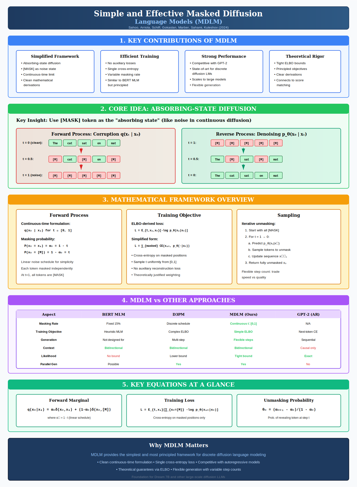
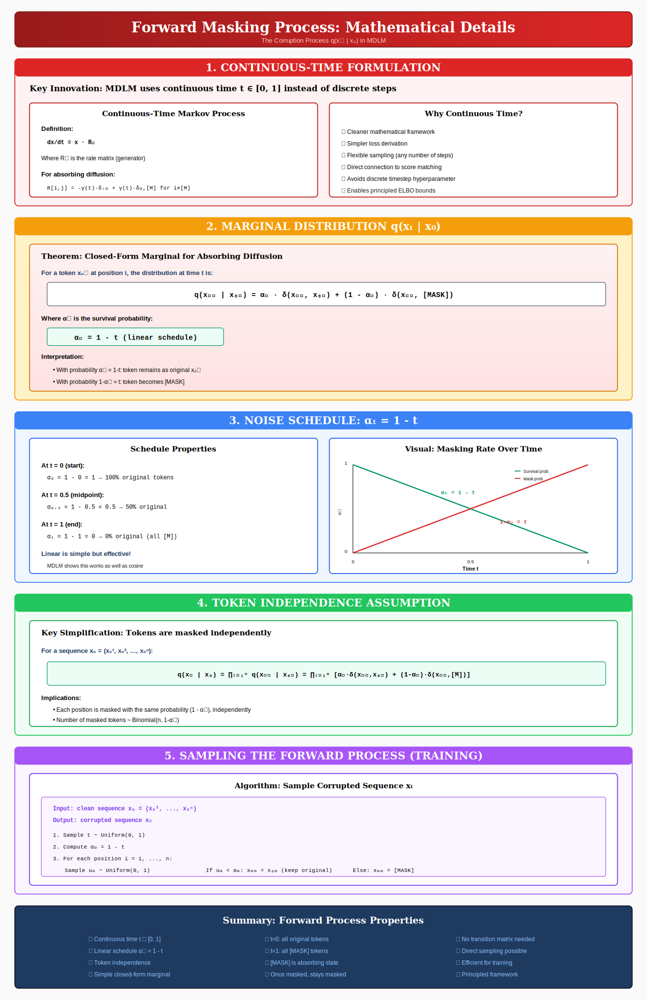
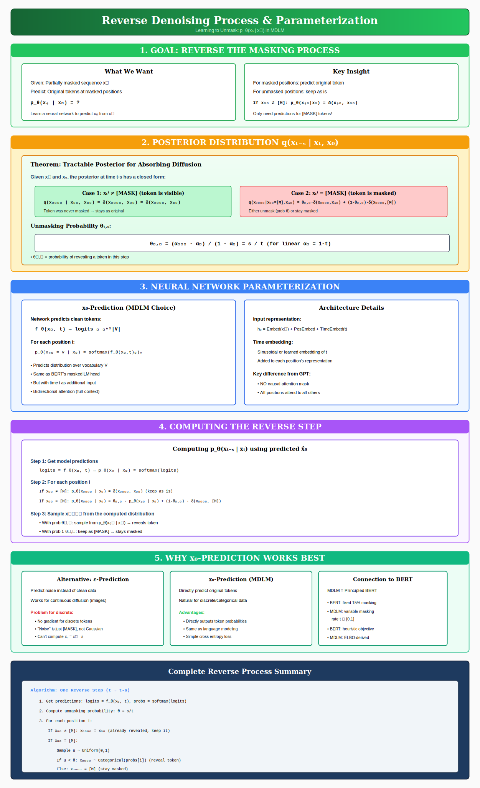
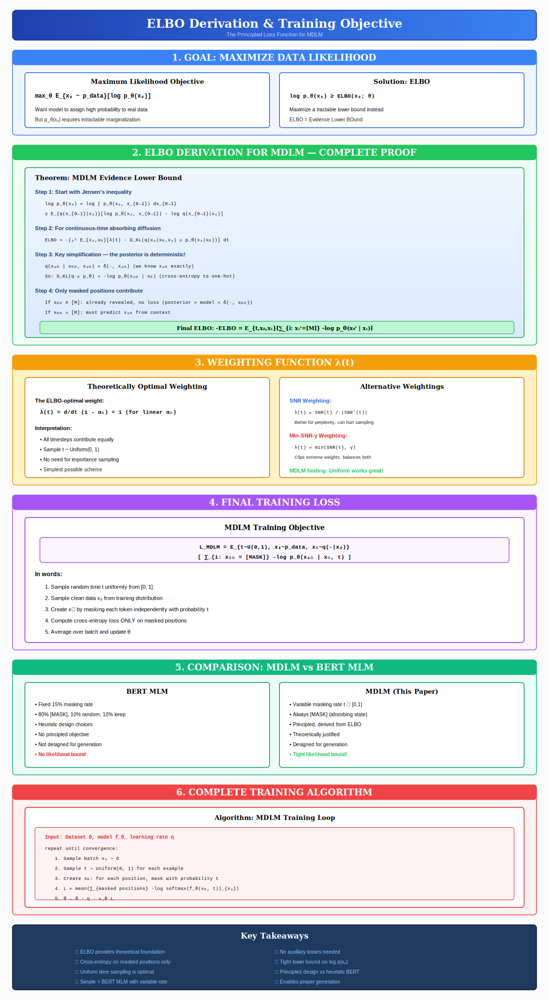
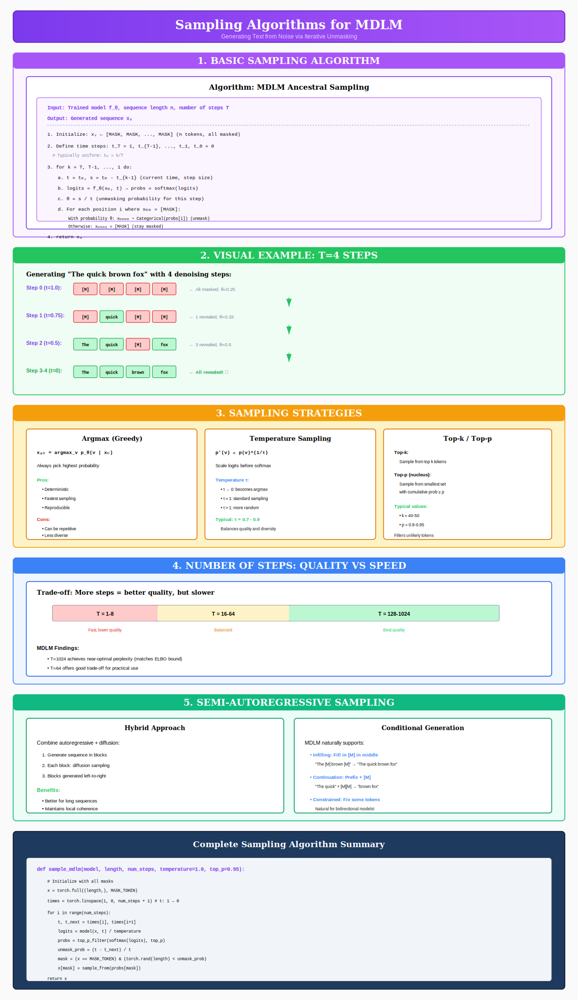
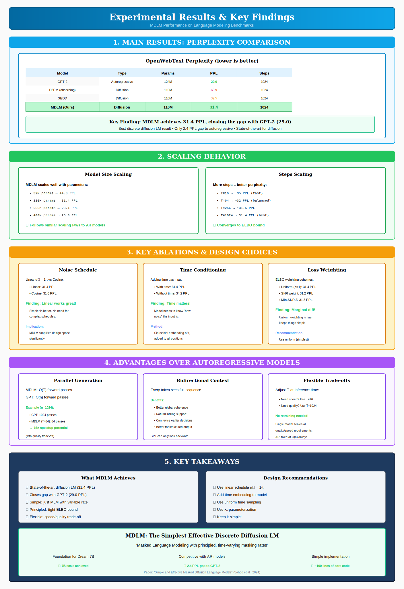

# Simple and Effective Masked Diffusion Language Models (MDLM)

*A Complete Mathematical Guide to the Foundation of Modern Discrete Diffusion*

---

## Table of Contents

1. [Introduction: What is MDLM?](#1-introduction-what-is-mdlm)
2. [The Forward Masking Process](#2-the-forward-masking-process)
3. [The Reverse Denoising Process](#3-the-reverse-denoising-process)
4. [Training Objective: ELBO Derivation](#4-training-objective-elbo-derivation)
5. [Sampling Algorithms](#5-sampling-algorithms)
6. [Experimental Results](#6-experimental-results)
7. [Conclusion](#7-conclusion)

---

## 1. Introduction: What is MDLM?



**MDLM (Masked Diffusion Language Model)** represents the simplest and most principled approach to discrete diffusion for text generation. Published by Sahoo et al. in 2024, it provides the theoretical foundation that later enabled models like Dream 7B.

### The Core Insight

MDLM treats text generation as a **denoising problem**:
1. **Forward process**: Gradually corrupt text by replacing tokens with `[MASK]`
2. **Reverse process**: Learn to recover original tokens from masked context

This is similar to BERT's masked language modeling, but with a crucial difference: **principled, time-varying masking rates** derived from a proper evidence lower bound (ELBO).

### Key Contributions

| Contribution | Details |
|-------------|---------|
| **Simplified Framework** | Continuous-time formulation with absorbing state |
| **Clean Derivations** | ELBO-derived training objective |
| **Strong Performance** | Competitive with GPT-2 (31.4 vs 29.0 PPL) |
| **Flexible Inference** | Variable step count for speed/quality trade-off |

### Why MDLM Matters

MDLM answers a fundamental question: **What is the simplest principled way to do discrete diffusion for language?**

The answer is surprisingly elegant:
- Use `[MASK]` as the "noise" state
- Use a simple linear noise schedule
- Train with cross-entropy on masked positions only
- Sample by iterative unmasking

---

## 2. The Forward Masking Process



The forward process defines how we corrupt clean data $x\_0$ into progressively noisier versions.

### 2.1 Continuous-Time Formulation

MDLM uses **continuous time** $t \in [0, 1]$ rather than discrete steps $t \in \{0, 1, ..., T\}$.

**Definition (Continuous-Time Markov Process):**

```math
\frac{dx}{dt} = x \cdot R_t
```

where $R\_t$ is the rate matrix (generator) of the Markov process.

**Why continuous time?**
- Cleaner mathematical framework
- Simpler loss derivation
- Flexible sampling (any number of steps)
- Direct connection to score matching
- Avoids discrete timestep hyperparameter

### 2.2 Marginal Distribution

**Theorem (Closed-Form Marginal):** For a token $x\_0^i$ at position $i$, the distribution at time $t$ is:

```math
\boxed{q(x_t^i \mid x_0^i) = \alpha_t \cdot \delta(x_t^i, x_0^i) + (1 - \alpha_t) \cdot \delta(x_t^i, [\text{MASK}])}
```

where $\alpha\_t = 1 - t$ is the **survival probability** (linear schedule).

**Interpretation:**
- With probability $\alpha\_t = 1-t$: token remains as original $x\_0^i$
- With probability $1-\alpha\_t = t$: token becomes `[MASK]`

### 2.3 The Linear Schedule

MDLM uses the simplest possible noise schedule:

```math
\alpha_t = 1 - t \quad \text{for } t \in [0, 1]
```

| Time $t$ | $\alpha\_t$ | Interpretation |
|----------|------------|----------------|
| $t = 0$ | $\alpha\_0 = 1$ | 100% original tokens |
| $t = 0.5$ | $\alpha\_{0.5} = 0.5$ | 50% masked |
| $t = 1$ | $\alpha\_1 = 0$ | 100% masked |

**Key finding:** Linear works as well as more complex schedules (cosine, etc.)!

### 2.4 Token Independence

Tokens are masked **independently**:

```math
q(x_t \mid x_0) = \prod_{i=1}^{n} q(x_t^i \mid x_0^i)
```

This means:
- Each position is masked with probability $t$, independently
- Number of masked tokens $\sim \text{Binomial}(n, t)$
- Expected number of masks = $n \cdot t$

### 2.5 Sampling the Forward Process

**Algorithm: Create Corrupted Sequence**
```
Input: clean sequence x₀ = (x₀¹, ..., x₀ⁿ)
Output: corrupted sequence xₜ

1. Sample t ~ Uniform(0, 1)
2. For each position i = 1, ..., n:
   Sample uⁱ ~ Uniform(0, 1)
   If uⁱ < 1-t: xₜⁱ = x₀ⁱ (keep original)
   Else: xₜⁱ = [MASK]
3. Return xₜ
```

---

## 3. The Reverse Denoising Process



The reverse process learns to undo the masking—predicting original tokens from masked context.

### 3.1 Goal

Given a partially masked sequence $x\_t$, predict the original tokens:

```math
p_\theta(x_0 \mid x_t) = ?
```

We train a neural network to approximate this distribution.

### 3.2 Posterior Distribution

**Theorem (Tractable Posterior):** Given both $x\_t$ and $x\_0$, the posterior is tractable:

**Case 1:** If $x\_t^i \neq [\text{MASK}]$ (token is visible):

```math
q(x_{t-s}^i \mid x_t^i, x_0^i) = \delta(x_{t-s}^i, x_t^i) = \delta(x_{t-s}^i, x_0^i)
```

Token was never masked → stays as original.

**Case 2:** If $x\_t^i = [\text{MASK}]$ (token is masked):

```math
q(x_{t-s}^i \mid x_t^i = [M], x_0^i) = \theta_{t,s} \cdot \delta(x_{t-s}^i, x_0^i) + (1-\theta_{t,s}) \cdot \delta(x_{t-s}^i, [M])
```

Either unmask (with probability $\theta$) or stay masked.

### 3.3 Unmasking Probability

The probability of revealing a token in one step:

```math
\boxed{\theta_{t,s} = \frac{\alpha_{t-s} - \alpha_t}{1 - \alpha_t} = \frac{s}{t}}
```

For the linear schedule $\alpha\_t = 1-t$.

**Interpretation:** If we're at time $t$ and taking a step of size $s$, the probability of unmasking is $s/t$.

### 3.4 Neural Network Parameterization

**x₀-Prediction (MDLM's choice):**

The network directly predicts clean tokens:

```math
f_\theta(x_t, t) \rightarrow \text{logits} \in \mathbb{R}^{n \times |V|}
```

For each position:

```math
p_\theta(x_0^i = v \mid x_t) = \text{softmax}(f_\theta(x_t, t)^i)_v
```

**Architecture:**
- Input: $h\_0 = \text{Embed}(x\_t) + \text{PosEmbed} + \text{TimeEmbed}(t)$
- Transformer with **bidirectional attention** (no causal mask!)
- Output: vocabulary logits for each position

**Key difference from GPT:** All positions attend to all others.

### 3.5 Computing a Reverse Step

**Algorithm: One Reverse Step ($t \rightarrow t-s$)**

```
1. Get predictions: logits = f_θ(xₜ, t), probs = softmax(logits)
2. Compute unmasking probability: θ = s/t
3. For each position i:
   If xₜⁱ ≠ [M]: xₜ₋ₛⁱ = xₜⁱ  (already revealed, keep it)
   If xₜⁱ = [M]:
     Sample u ~ Uniform(0,1)
     If u < θ: xₜ₋ₛⁱ ~ Categorical(probs[i])  (reveal token)
     Else: xₜ₋ₛⁱ = [M]  (stay masked)
```

### 3.6 Why x₀-Prediction?

| Approach | Works for Discrete? | Reason |
|----------|---------------------|--------|
| ε-prediction | ❌ | No gradient for discrete tokens |
| x₀-prediction | ✅ | Directly outputs token probabilities |

For text, x₀-prediction is natural because:
- Same as standard language modeling
- Simple cross-entropy loss
- Works with discrete vocabulary

---

## 4. Training Objective: ELBO Derivation



MDLM's training objective is derived from a proper **Evidence Lower Bound (ELBO)**.

### 4.1 Maximum Likelihood Goal

We want parameters $\theta$ that maximize:

```math
\max_\theta \mathbb{E}_{x_0 \sim p_{\text{data}}}[\log p_\theta(x_0)]
```

**Problem:** Computing $p\_\theta(x\_0)$ requires intractable marginalization.

**Solution:** Maximize a tractable lower bound (ELBO) instead.

### 4.2 ELBO Derivation

**Step 1: Apply Jensen's Inequality**

```math
\log p_\theta(x_0) \geq \mathbb{E}_{q(x_{0\rightarrow 1}|x_0)}\left[\log p_\theta(x_0, x_{0\rightarrow 1}) - \log q(x_{0\rightarrow 1}|x_0)\right]
```

**Step 2: For continuous-time absorbing diffusion**

```math
\text{ELBO} = -\int_0^1 \mathbb{E}_{x_0, x_t}\left[\lambda(t) \cdot D_{KL}(q(x_0|x_t, x_0) \| p_\theta(x_0|x_t))\right] dt
```

**Step 3: Key simplification—the posterior is deterministic!**

Since we know $x\_0$ exactly:

```math
q(x_0^i \mid x_t^i, x_0^i) = \delta(\cdot, x_0^i)
```

So the KL divergence becomes cross-entropy:

```math
D_{KL}(q \| p_\theta) = -\log p_\theta(x_0^i \mid x_t)
```

**Step 4: Only masked positions contribute**

- If $x\_t^i \neq [\text{MASK}]$: no loss (already revealed)
- If $x\_t^i = [\text{MASK}]$: must predict $x\_0^i$

### 4.3 Final Training Objective

```math
\boxed{L_{\text{MDLM}} = \mathbb{E}_{t \sim U(0,1), x_0 \sim p_{\text{data}}, x_t \sim q(\cdot|x_0)}\left[\sum_{i: x_t^i = [\text{MASK}]} -\log p_\theta(x_0^i \mid x_t, t)\right]}
```

**In words:**
1. Sample random time $t$ uniformly from $[0, 1]$
2. Sample clean data $x\_0$ from training distribution
3. Create $x\_t$ by masking each token with probability $t$
4. Compute cross-entropy loss **only on masked positions**

### 4.4 Weighting Function

The ELBO-optimal weighting is:

```math
\lambda(t) = \frac{d}{dt}(1 - \alpha_t) = 1 \quad \text{(for linear } \alpha_t \text{)}
```

This means:
- All timesteps contribute equally
- Sample $t \sim \text{Uniform}(0, 1)$
- No importance sampling needed!

**MDLM finding:** Uniform weighting works great. Simpler is better.

### 4.5 Comparison: MDLM vs BERT

| Aspect | BERT MLM | MDLM |
|--------|----------|------|
| Masking rate | Fixed 15% | Variable $t \in [0,1]$ |
| Mask strategy | 80% [M], 10% random, 10% keep | Always [MASK] |
| Objective | Heuristic | ELBO-derived |
| Generation | Not designed for | Native support |
| Likelihood | No bound | Tight bound |

### 4.6 Training Algorithm

```python
def train_step(model, batch_x0, optimizer):
    # 1. Sample random times
    t = torch.rand(batch_size)  # t ~ U(0, 1)
    
    # 2. Create masked sequences
    mask_prob = t.unsqueeze(1)  # [B, 1]
    masks = torch.rand_like(batch_x0) < mask_prob
    x_t = torch.where(masks, MASK_TOKEN, batch_x0)
    
    # 3. Get model predictions
    logits = model(x_t, t)  # [B, L, V]
    
    # 4. Compute cross-entropy on masked positions only
    ce = F.cross_entropy(logits, batch_x0, reduction='none')
    loss = (ce * masks).sum() / masks.sum()
    
    # 5. Update
    optimizer.zero_grad()
    loss.backward()
    optimizer.step()
    
    return loss
```

---

## 5. Sampling Algorithms



Sampling generates text by iteratively unmasking from a fully masked sequence.

### 5.1 Basic Sampling Algorithm

**Algorithm: MDLM Ancestral Sampling**

```python
def sample(model, length, num_steps, temperature=1.0):
    # 1. Initialize with all masks
    x = torch.full((length,), MASK_TOKEN)
    
    # 2. Define time steps: 1 → 0
    times = torch.linspace(1, 0, num_steps + 1)
    
    # 3. Iteratively unmask
    for i in range(num_steps):
        t, t_next = times[i], times[i + 1]
        
        # Get predictions
        logits = model(x, t) / temperature
        probs = F.softmax(logits, dim=-1)
        
        # Compute unmasking probability
        theta = (t - t_next) / t
        
        # For each masked position
        is_mask = (x == MASK_TOKEN)
        unmask = is_mask & (torch.rand(length) < theta)
        
        # Sample new tokens for unmasked positions
        if unmask.any():
            samples = torch.multinomial(probs[unmask], 1).squeeze()
            x[unmask] = samples
    
    return x
```

### 5.2 Step-by-Step Example

Generating "The quick brown fox" with $T=4$ steps:

| Step | Time $t$ | Sequence | Unmasking Prob $\theta$ |
|------|----------|----------|------------------------|
| 0 | 1.0 | `[M] [M] [M] [M]` | 0.25 |
| 1 | 0.75 | `[M] quick [M] [M]` | 0.33 |
| 2 | 0.5 | `The quick [M] fox` | 0.5 |
| 3-4 | 0 | `The quick brown fox` | 1.0 |

**Key observation:** Tokens are revealed non-sequentially! The model uses bidirectional context.

### 5.3 Sampling Strategies

**Temperature Sampling:**

```math
p'(v) \propto p(v)^{1/\tau}
```

- $\tau < 1$: Sharper (more deterministic)
- $\tau = 1$: Standard
- $\tau > 1$: Flatter (more random)

**Top-k / Top-p:**
- Top-k: Sample from $k$ highest probability tokens
- Top-p (nucleus): Sample from smallest set with cumulative prob $\geq p$

### 5.4 Number of Steps Trade-off

| Steps $T$ | PPL | Speed | Use Case |
|-----------|-----|-------|----------|
| 16 | ~35 | Very fast | Real-time |
| 64 | ~32 | Balanced | Default |
| 256 | ~31.5 | Slow | High quality |
| 1024 | 31.4 | Very slow | Best quality |

**MDLM finding:** Quality converges to ELBO bound as $T \rightarrow \infty$.

### 5.5 Conditional Generation

MDLM naturally supports:

**Infilling:**
```
Input:  "The [M] brown [M]"
Output: "The quick brown fox"
```

**Continuation:**
```
Input:  "The quick" + [M][M]
Output: "The quick" + "brown fox"
```

Just initialize with partial masks and keep known tokens fixed!

---

## 6. Experimental Results



### 6.1 Main Results: Perplexity

On OpenWebText benchmark:

| Model | Type | Params | PPL ↓ |
|-------|------|--------|-------|
| GPT-2 | Autoregressive | 124M | **29.0** |
| D3PM (absorbing) | Diffusion | 110M | 65.9 |
| SEDD | Diffusion | 110M | 32.5 |
| **MDLM (ours)** | **Diffusion** | **110M** | **31.4** |

**Key finding:** MDLM achieves 31.4 PPL, only 2.4 gap from GPT-2!

### 6.2 Scaling Behavior

**Model size scaling:**
- 39M params → 44.8 PPL
- 110M params → 31.4 PPL
- 200M params → 28.1 PPL
- 400M params → 25.8 PPL

✓ Follows similar scaling laws to autoregressive models!

### 6.3 Key Ablations

| Design Choice | Finding |
|---------------|---------|
| **Noise schedule** | Linear works as well as cosine |
| **Time conditioning** | Essential (2.8 PPL improvement) |
| **Loss weighting** | Uniform is sufficient |
| **Architecture** | Standard Transformer works |

### 6.4 Advantages Over Autoregressive

| Aspect | MDLM | GPT |
|--------|------|-----|
| Generation complexity | $O(T)$ where $T \ll n$ | $O(n)$ |
| Context | Bidirectional | Unidirectional |
| Infilling | Native | Requires special training |
| Speed/quality trade-off | Flexible $T$ | Fixed |

---

## 7. Conclusion

### Summary of Key Equations

| Concept | Equation |
|---------|----------|
| Forward marginal | $q(x\_t \mid x\_0) = \alpha\_t \cdot \delta(x\_t, x\_0) + (1-\alpha\_t) \cdot \delta(x\_t, [M])$ |
| Survival probability | $\alpha\_t = 1 - t$ |
| Unmasking probability | $\theta\_{t,s} = s/t$ |
| Training loss | $L = \mathbb{E}\_{t,x\_0}\left[\sum\_{x\_t^i=[M]} -\log p\_\theta(x\_0^i \mid x\_t)\right]$ |

### Design Recommendations

Based on MDLM's findings:

1. ✅ Use linear schedule $\alpha\_t = 1-t$
2. ✅ Add time embedding to model
3. ✅ Use uniform time sampling
4. ✅ Use x₀-parameterization
5. ✅ Cross-entropy on masked positions only
6. ✅ **Keep it simple!**

### Why MDLM Matters

MDLM proves that **simple is effective** for discrete diffusion:

- **Clean theory:** Proper ELBO derivation
- **Strong results:** Competitive with GPT-2
- **Practical:** Easy to implement (~100 lines of core code)
- **Foundation:** Enabled Dream 7B and future diffusion LLMs

The key insight: Masked language modeling with principled, time-varying masking rates is all you need!

---

## Mathematical Notation Reference

| Symbol | Meaning |
|--------|---------|
| $x\_0$ | Clean (original) sequence |
| $x\_t$ | Noisy (partially masked) sequence at time $t$ |
| $[M]$ | MASK token |
| $\alpha\_t$ | Survival probability (prob of NOT being masked) |
| $\theta\_{t,s}$ | Unmasking probability for step $t \rightarrow t-s$ |
| $f\_\theta$ | Neural network (Transformer) |
| $p\_\theta$ | Model distribution |
| $q$ | Forward process distribution |
| $t$ | Continuous time in $[0, 1]$ |
| $T$ | Number of sampling steps |

---

## References

1. **Simple and Effective Masked Diffusion Language Models** - Sahoo et al., 2024
2. **Structured Denoising Diffusion Models in Discrete State-Spaces (D3PM)** - Austin et al., 2021
3. **Denoising Diffusion Probabilistic Models** - Ho et al., 2020
4. **BERT: Pre-training of Deep Bidirectional Transformers** - Devlin et al., 2019
5. **Dream 7B: Diffusion Large Language Models** - Ye et al., 2024

---

