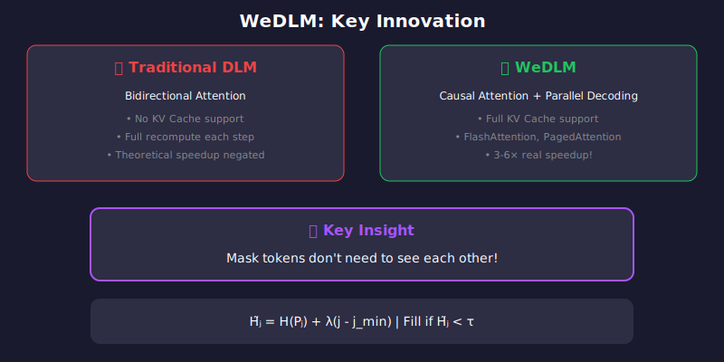
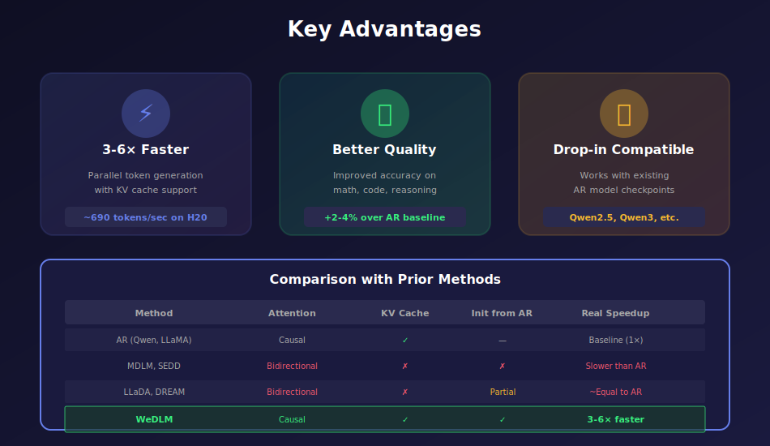
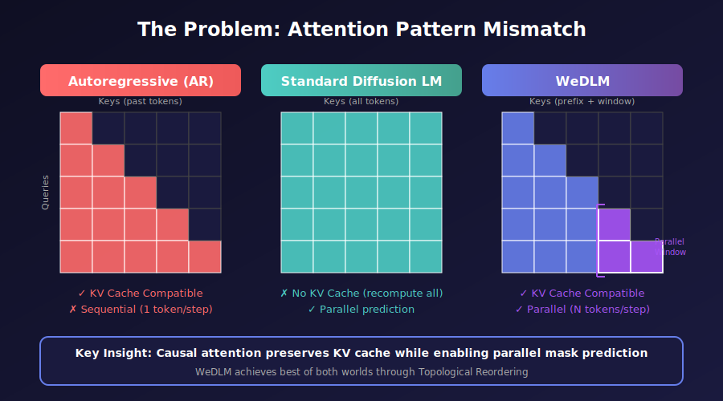
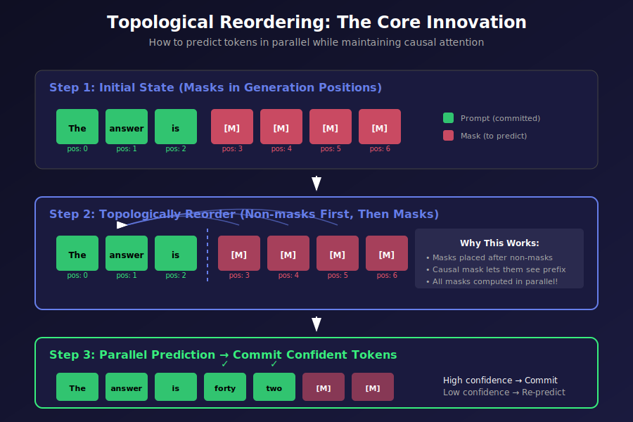
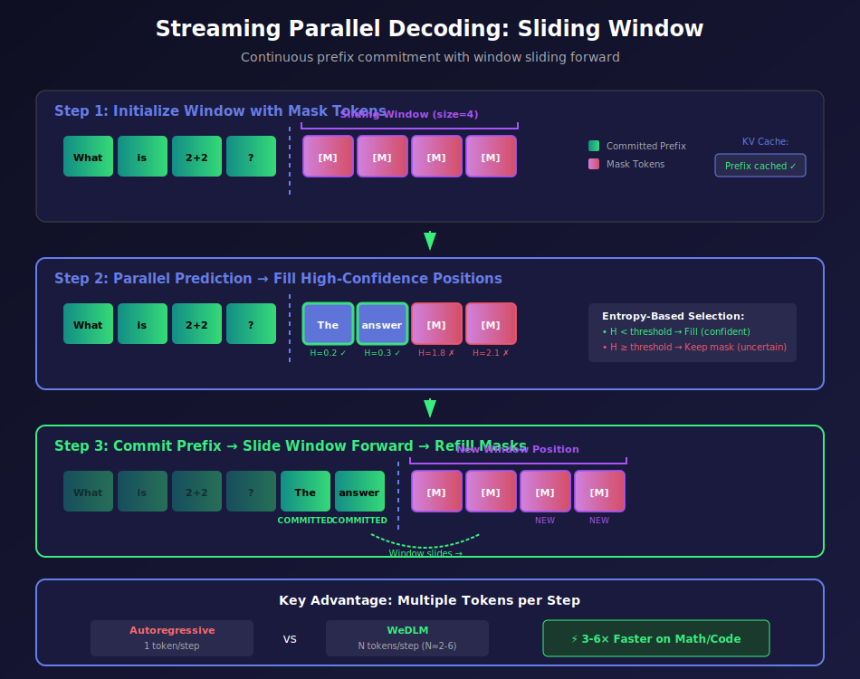
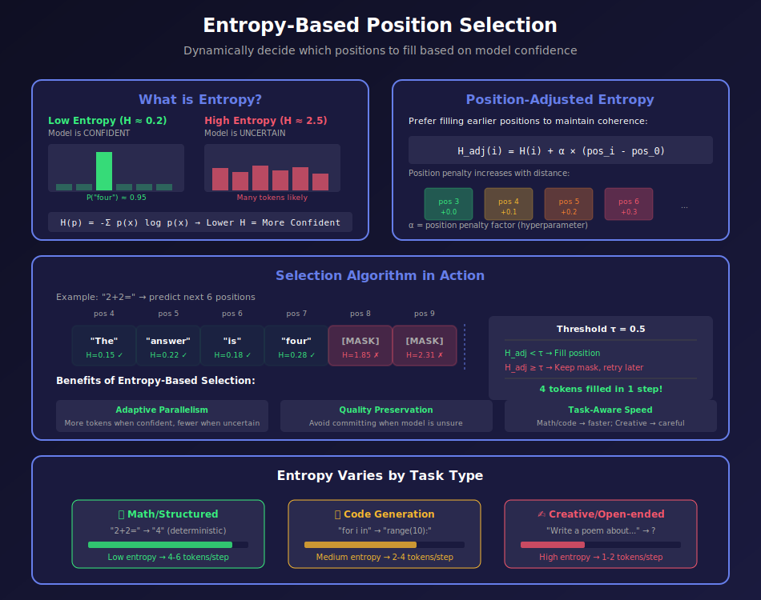
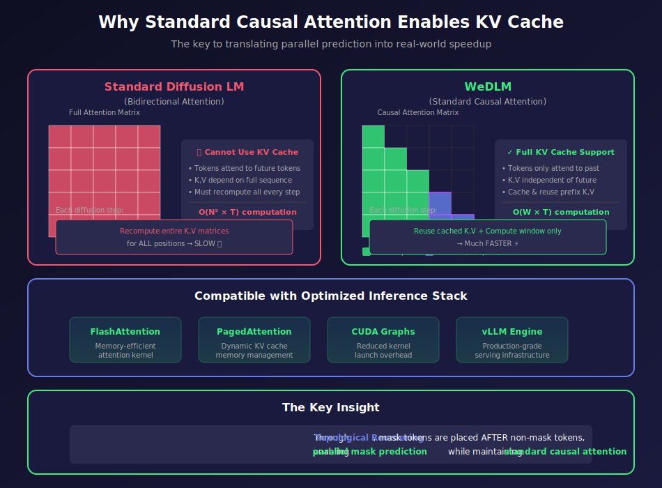
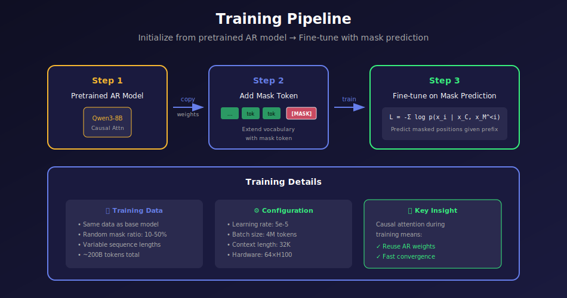

<div align="center">

# 🚀 WeDLM

### Reconciling Diffusion Language Models with Causal Attention for Fast Inference

[](https://arxiv.org/abs/2512.22737)
[]()
[]()
[]()

<br>



<br>

**The first diffusion language model with full KV cache support — achieving 3-6× speedup over standard AR decoding**

<br>

| 🎬 **Demo** |
|:---:|
|  |

</div>

---

## ✨ Highlights

<table>
<tr>
<td width="33%" align="center">

### ⚡ 3-6× Faster
Parallel token generation with entropy-based selection

</td>
<td width="33%" align="center">

### 🔧 Drop-in Compatible
Works with existing AR models (Qwen, LLaMA, etc.)

</td>
<td width="33%" align="center">

### 🎯 Better Quality
Improved accuracy on math, code & reasoning

</td>
</tr>
</table>

---

## 🎯 Key Innovation

> **Mask tokens don't need to see each other!**

WeDLM uses **causal attention** (like standard LLMs) but generates **multiple tokens per step** through entropy-based parallel decoding:

```
Step 1: "The quick [M] [M] [M] [M]"     → Compute entropy, fill confident positions
Step 2: "The quick brown fox [M] [M]"  → Continue filling
Step 3: "The quick brown fox jumps over" → Done in 3 steps instead of 6!

```

<div align="center">

| Traditional AR | WeDLM |
|:---:|:---:|
| 1 token/step | 2-6 tokens/step |
| No parallel decoding | Entropy-based parallel fill |
| — | Full KV cache support ✓ |

</div>

---

## 📊 Results

<div align="center">


</div>

| Benchmark | Task | WeDLM Speedup |
|-----------|------|:-------------:|
| **GSM8K** | Math Reasoning | 4-6× |
| **HumanEval** | Code Generation | 3-4× |
| **MMLU** | Knowledge QA | 2-3× |
| **ARC** | Science Reasoning | 2-3× |

---

## 🚀 Quick Start

### Installation

```bash
git clone https://github.com/Gaurav14cs17/05_WeDLM_Reconciling_Diffusion_with_Causal_Attention.git
cd 05_WeDLM_Reconciling_Diffusion_with_Causal_Attention
pip install -r requirements.txt

```

### Run Inference

```python
from wedlm import LLM, SamplingParams

# Load model
llm = LLM(model="Qwen/Qwen2.5-0.5B")

# Generate with WeDLM parallel decoding
params = SamplingParams(
    max_tokens=100,
    wedlm_entropy_threshold=0.4,  # τ: fill positions with entropy < τ
    wedlm_pos_penalty_factor=0.02  # λ: left-to-right bias
)

output = llm.generate("Solve: 15 × 7 + 23 = ", params)
print(output)

```

### Train Your Own

```bash
python scripts/train.py \
    --model Qwen/Qwen2.5-0.5B \
    --dataset wikitext \
    --output ./wedlm_model \
    --epochs 3

```

---

## 📓 Interactive Notebooks

<div align="center">

| Notebook | Description | Colab |
|:---------|:------------|:-----:|
| **Training** | Fine-tune AR model → WeDLM | [](https://colab.research.google.com/github/Gaurav14cs17/Diffusion-Language-Model/blob/main/05_WeDLM_Reconciling_Diffusion_with_Causal_Attention/notebooks/WeDLM_Training.ipynb) |
| **Inference** | Fast parallel generation demo | [](https://colab.research.google.com/github/Gaurav14cs17/Diffusion-Language-Model/blob/main/05_WeDLM_Reconciling_Diffusion_with_Causal_Attention/notebooks/WeDLM_Inference.ipynb) |

</div>

---

## 📐 The Algorithm

<div align="center">

```
+-------------------------------------------------------------------------+

|                        WeDLM Inference Flow                             |
+-------------------------------------------------------------------------+
|                                                                         |
|   Prefix (KV Cached)              Window (Processing)                   |
|   +-----+-----+-----+            +---+---+---+---+---+---+---+---+      |
|   | The |quick|brown|            | M | M | M | M | M | M | M | M |      |
|   +-----+-----+-----+            +---+---+---+---+---+---+---+---+      |
|                                           |                             |
|                                           ▼                             |
|                            +--------------------------+                 |
|                            |  1. Forward Pass (Causal)|                 |
|                            +--------------------------+                 |
|                                           |                             |
|                                           ▼                             |
|                            +--------------------------+                 |
|                            |  2. Compute Entropy H(P) |                 |
|                            |     for each mask token  |                 |
|                            +--------------------------+                 |
|                                           |                             |
|                                           ▼                             |
|                            +--------------------------+                 |
|                            |  3. Fill positions where |                 |
|                            |     H̃ < threshold τ      |                 |
|                            +--------------------------+                 |
|                                           |                             |
|                                           ▼                             |
|                            +--------------------------+                 |
|                            |  4. Commit prefix tokens |                 |
|                            |     & slide window       |                 |
|                            +--------------------------+                 |
|                                                                         |
+-------------------------------------------------------------------------+

```

</div>

**Key Formula — Adjusted Entropy:**

```math
\tilde{H}_j = H(P_j) + \lambda(j - j_{\min}), \quad \text{Fill if } \tilde{H}_j < \tau

```

---

## 📁 Project Structure

```
📦 WeDLM/
+-- 📂 wedlm/                    # Core library

|   +-- __init__.py              # LLM, SamplingParams exports
|   +-- llm.py                   # High-level API
|   +-- engine/                  # Inference engine

|   |   +-- llm_engine.py
|   |   +-- wedlm_decoder.py     # Parallel decoding logic

|   |   +-- sampler.py           # Entropy-based sampling
|   +-- layers/                  # Model layers

|   +-- models/                  # Model definitions
|
+-- 📂 scripts/                  # CLI tools
|   +-- train.py                 # Training script

|   +-- inference.py             # Generation script
|   +-- evaluate.py              # Benchmark evaluation
|   +-- download_data.py         # Dataset downloader

|
+-- 📂 notebooks/                # Interactive tutorials
|   +-- WeDLM_Training.ipynb
|   +-- WeDLM_Inference.ipynb

|
+-- 📂 evaluation/               # Benchmark system
|   +-- benchmarks/              # GSM8K, MMLU, HumanEval, ARC
|
+-- 📂 docs/                     # Documentation

|   +-- WeDLM_Paper_Explained.md
|   +-- math_explained/          # Visual guides
|
+-- 📂 data/                     # Downloaded datasets

```

---

## 📚 Documentation

| Resource | Description |
|:---------|:------------|
| [📄 **Paper Explained**](./docs/README.md) | Full mathematical walkthrough of WeDLM |
| [🎨 **Visual Math Guide**](./docs/math_explained/README.md) | Interactive SVG diagrams for key concepts |

<details>
<summary><b>📊 View All Diagrams</b></summary>

| Diagram | Preview |
|:--------|:-------:|
| Key Advantages |  |
| AR vs Diffusion |  |
| Topological Reordering |  |
| Sliding Window |  |
| Entropy Selection |  |
| KV Cache Efficiency |  |
| Training Overview |  |

</details>

---

## ⚙️ Configuration

### Sampling Parameters

| Parameter | Default | Description |
|:----------|:-------:|:------------|
| `temperature` | 0.2 | Sampling temperature (0 = greedy) |
| `max_tokens` | 64 | Maximum tokens to generate |
| `wedlm_entropy_threshold` (τ) | 0.4 | Fill positions with adjusted entropy < τ |
| `wedlm_pos_penalty_factor` (λ) | 0.02 | Position penalty for left-to-right bias |

### Recommended Settings

| Use Case | τ | λ | Expected Speedup |
|:---------|:-:|:-:|:----------------:|
| Math / Code | 0.4-0.6 | 0.02 | **3-6×** |
| General QA | 0.3-0.4 | 0.02 | **2-3×** |
| Creative Writing | 0.2-0.3 | 0.01 | **1.5-2×** |

---

## 🔧 Requirements

```
Python 3.8+
PyTorch 2.0+
transformers
datasets
tqdm
accelerate

```

**Optional (GPU acceleration):**

```
flash-attn
triton

```

---

## 📄 Citation

```bibtex
@article{liu2025wedlm,
  title={WeDLM: Reconciling Diffusion Language Models with Standard Causal Attention for Fast Inference},
  author={Liu, Ao and others},
  journal={arXiv preprint arXiv:2512.22737},
  year={2025}
}

```

---

<div align="center">

[📄 Paper](https://arxiv.org/abs/2512.22737) • [💻 Code](https://github.com/Tencent/WeDLM) • [🤗 Models](https://huggingface.co/collections/tencent/wedlm)

</div>
