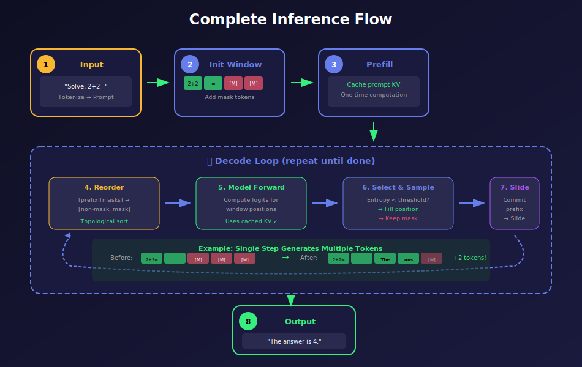
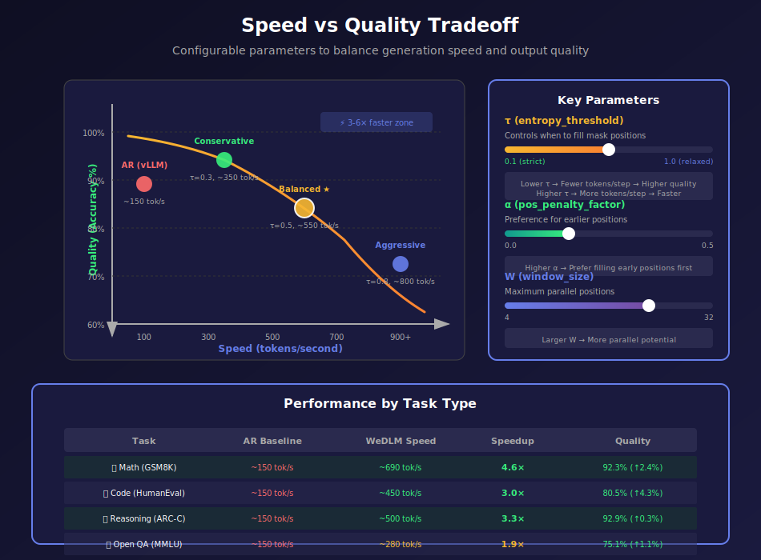
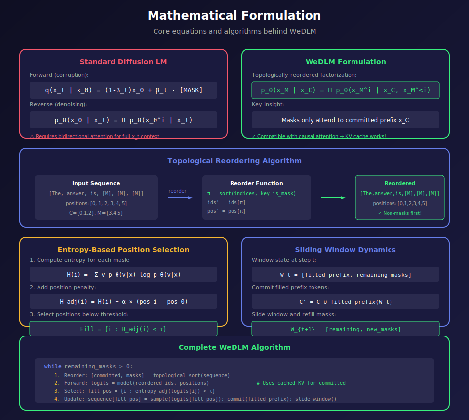

# 🧠 WeDLM: The Math Behind the Speed

### Visual Guide to Reconciling Diffusion LMs with Causal Attention

---

## 🏆 Key Advantages

---

## 🎯 The Core Problem

---

## 🔑 Key Innovation: Topological Reordering

---

## 🪟 Streaming Parallel Decoding

---

## ⚡ Why Standard Causal Attention Matters

---

## 📊 Entropy-Based Position Selection

---

## 🔄 Complete Inference Flow

---

## 🚀 Speed vs Quality Tradeoff

---

## 🎓 Training Pipeline

---

## 📐 Mathematical Formulation

---

### 📄 [Full Paper](https://arxiv.org/abs/2512.22737) • 🌐 [Project Page](https://wedlm.github.io)

