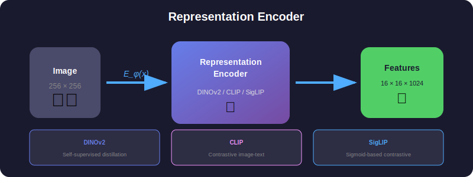
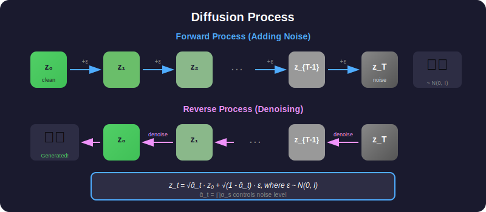
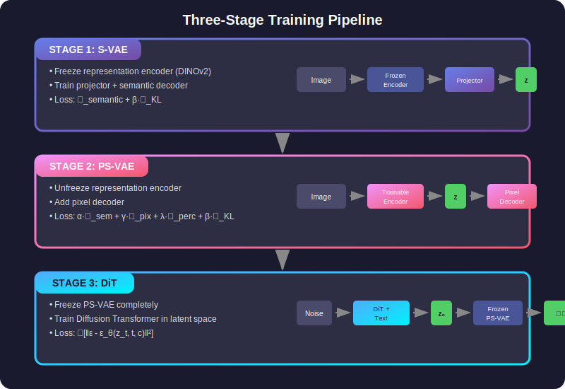

# 🎓 PS-VAE Theory: From First Principles

> A comprehensive guide to understanding PS-VAE from mathematical foundations to implementation details.

---

## 📚 Table of Contents

| Chapter | Topic | Description |
|---------|-------|-------------|
| [01](#01-representation-learning-fundamentals) | Representation Learning | What are representation encoders? |
| [02](#02-the-generation-gap) | The Generation Gap | Why can't we generate with representations? |
| [03](#03-variational-autoencoders) | Variational Autoencoders | VAE fundamentals and ELBO |
| [04](#04-s-vae-semantic-vae) | S-VAE | Semantic VAE architecture |
| [05](#05-ps-vae-pixel-semantic-vae) | PS-VAE | Adding pixel reconstruction |
| [06](#06-diffusion-models) | Diffusion Models | Diffusion theory for latent space |
| [07](#07-dit-architecture) | DiT Architecture | Diffusion Transformer design |
| [08](#08-training-pipeline) | Training Pipeline | Three-stage training procedure |
| [09](#09-inference) | Inference | Sampling and generation |
| [10](#10-advanced-topics) | Advanced Topics | Editing, inpainting, and more |

---

## 01. Representation Learning Fundamentals

### What is a Representation Encoder?

  

### Mathematical Definition

Given an image $\mathbf{x} \in \mathbb{R}^{H \times W \times 3}$, a representation encoder produces:

$$
\mathbf{f} = E_\phi(\mathbf{x}) \in \mathbb{R}^{h \times w \times d}
$$

where:
- $h = w = H/p$ (patch size $p = 14$ for DINOv2)
- $d = 1024$ for DINOv2-Large
- $\phi$ are the pretrained encoder parameters

### Why Are They Powerful?

These features are **semantically meaningful** - they encode high-level understanding:
- ✓ Object identity ("This is a dog")
- ✓ Object category ("It's a golden retriever")
- ✓ Scene context ("It's sitting on grass")
- ✓ Attributes ("It looks happy")

---

## 02. The Generation Gap

### Problem 1: Off-Manifold Generation

  

**Mathematical Formulation:**

Without regularization, the diffusion model learns:

$$
p_\theta(\mathbf{f}) \neq p_{\text{data}}(\mathbf{f})
$$

Generated features $\hat{\mathbf{f}} \sim p\_\theta$ often fall outside the valid manifold $\mathcal{M}$, causing:

$$
D(\hat{\mathbf{f}}) = \text{garbage}
$$

### Problem 2: Weak Pixel Reconstruction

  

---

## 03. Variational Autoencoders

### The VAE Framework

  

### The ELBO (Evidence Lower Bound)

The VAE optimizes the ELBO:

$$
\log p(\mathbf{x}) \geq \mathbb{E}_{q(\mathbf{z}|\mathbf{x})}[\log p(\mathbf{x}|\mathbf{z})] - D_{\text{KL}}(q(\mathbf{z}|\mathbf{x}) \| p(\mathbf{z}))
$$

Which gives us the loss:

$$
\mathcal{L}_{\text{VAE}} = \underbrace{\mathcal{L}_{\text{recon}}}_{\text{Reconstruction}} + \underbrace{\beta \cdot \mathcal{L}_{\text{KL}}}_{\text{Regularization}}
$$

### The Reparameterization Trick

To enable backpropagation through sampling:

$$
\mathbf{z} = \boldsymbol{\mu} + \boldsymbol{\sigma} \odot \boldsymbol{\epsilon}, \quad \boldsymbol{\epsilon} \sim \mathcal{N}(\mathbf{0}, \mathbf{I})
$$

### KL Divergence for Gaussians

For $q(\mathbf{z}|\mathbf{x}) = \mathcal{N}(\boldsymbol{\mu}, \text{diag}(\boldsymbol{\sigma}^2))$ and $p(\mathbf{z}) = \mathcal{N}(\mathbf{0}, \mathbf{I})$:

$$
\mathcal{L}_{\text{KL}} = -\frac{1}{2} \sum_{i=1}^{d} \left( 1 + \log \sigma_i^2 - \mu_i^2 - \sigma_i^2 \right)
$$

---

## 04. S-VAE: Semantic VAE

### Architecture

  

### S-VAE Loss Function

$$
\mathcal{L}_{\text{S-VAE}} = \mathcal{L}_{\text{semantic}} + \beta \cdot \mathcal{L}_{\text{KL}}
$$

where:

$$
\mathcal{L}_{\text{semantic}} = \text{MSE}(\hat{\mathbf{f}}, \mathbf{f}) = \frac{1}{hwd} \sum_{i,j,k} (\hat{f}_{ijk} - f_{ijk})^2
\mathcal{L}_{\text{KL}} = -\frac{1}{2} \sum_{i} (1 + \log \sigma_i^2 - \mu_i^2 - \sigma_i^2)
$$

### Why S-VAE Works

| Before S-VAE | After S-VAE |
|--------------|-------------|
| Features: 16×16×1024 = 262,144 dims | Latent: 16×16×96 = 24,576 dims |
| No regularization | KL regularization → z ≈ N(0,I) |
| Diffusion generates anywhere | Diffusion stays on manifold |

**Compression: 262,144 → 24,576 (10.7× reduction!)**

---

## 05. PS-VAE: Pixel-Semantic VAE

### From S-VAE to PS-VAE

  

### PS-VAE Loss Function

  

| Loss Component | Formula | Weight |
|----------------|---------|--------|
| Semantic | $\text{MSE}(D\_{\text{sem}}(\mathbf{z}), E\_{\text{frozen}}(\mathbf{x}))$ | α = 1.0 |
| Pixel | $\frac{1}{2}\text{L1}(\hat{\mathbf{x}}, \mathbf{x}) + \frac{1}{2}\text{MSE}(\hat{\mathbf{x}}, \mathbf{x})$ | γ = 1.0 |
| Perceptual | $\text{LPIPS}(\hat{\mathbf{x}}, \mathbf{x})$ | λ = 0.1 |
| KL | $-\frac{1}{2}\sum(1 + \log\sigma^2 - \mu^2 - \sigma^2)$ | β = 10⁻⁴ |

---

## 06. Diffusion Models

### Forward and Reverse Process

  

### Training Objective

$$
\mathcal{L}_{\text{diffusion}} = \mathbb{E}_{\mathbf{z}_0, \boldsymbol{\epsilon}, t} \left[ \left\| \boldsymbol{\epsilon} - \boldsymbol{\epsilon}_\theta(\mathbf{z}_t, t) \right\|_2^2 \right]
$$

---

## 07. DiT Architecture

### Diffusion Transformer Block

  

### Classifier-Free Guidance (CFG)

$$
\tilde{\boldsymbol{\epsilon}}_\theta = \boldsymbol{\epsilon}_\theta(\mathbf{z}_t, t, \varnothing) + s \cdot \left( \boldsymbol{\epsilon}_\theta(\mathbf{z}_t, t, \mathbf{c}) - \boldsymbol{\epsilon}_\theta(\mathbf{z}_t, t, \varnothing) \right)
$$

where $s$ is the guidance scale (typically 7.5).

---

## 08. Training Pipeline

  

### Stage Details

| Stage | What's Trained | What's Frozen | Loss |
|-------|---------------|---------------|------|
| 1: S-VAE | Projector, Sem. Decoder | Encoder | MSE + β·KL |
| 2: PS-VAE | Encoder, All Decoders | Frozen Encoder Copy | Full PS-VAE Loss |
| 3: DiT | DiT | PS-VAE | MSE(ε, ε_θ) |

---

## 09. Inference

### DDIM Sampling Algorithm

1. **Initialize**: $z\_T \sim \mathcal{N}(0, I)$

2. **For** $t = T, T-1, \ldots, 1$:
   
   a. Predict noise with CFG: $\tilde{\epsilon} = \text{CFG}(\epsilon\_\theta(z\_t, t, c), \epsilon\_\theta(z\_t, t, \varnothing), s)$
   
   b. Predict $z\_0$: $\hat{z}\_0 = (z\_t - \sqrt{1 - \bar{\alpha}\_t} \cdot \tilde{\epsilon}) / \sqrt{\bar{\alpha}\_t}$
   
   c. Compute $z\_{t-1}$: $z\_{t-1} = \sqrt{\bar{\alpha}\_{t-1}} \cdot \hat{z}\_0 + \sqrt{1 - \bar{\alpha}\_{t-1}} \cdot \tilde{\epsilon}$

3. **Decode**: $\text{image} = \text{PS-VAE.decode}(z\_0)$

---

## 10. Advanced Topics

### Image Editing

1. **Encode** source image: $z = \text{PS-VAE.encode}(x)$
2. **Add noise** to timestep $t$: $z\_t = \sqrt{\bar{\alpha}\_t} \cdot z + \sqrt{1-\bar{\alpha}\_t} \cdot \epsilon$
3. **Denoise** with new prompt: $z'\_0 = \text{DDIM}(z\_t, \text{new\_prompt})$
4. **Decode**: $x' = \text{PS-VAE.decode}(z'\_0)$

The edit strength is controlled by $t$:
- **Small t** → Minor edits (style, color)
- **Large t** → Major edits (structure, content)

---

## 📚 Summary

| Component | Purpose | Key Innovation |
|-----------|---------|----------------|
| **S-VAE** | Compact latent space | KL regularization prevents off-manifold |
| **PS-VAE** | Add pixel quality | Dual semantic + pixel objectives |
| **DiT** | Text-to-image | Diffusion in regularized latent space |

---

**Next: See [architecture.md](../architecture.md) for complete mathematical details.**
