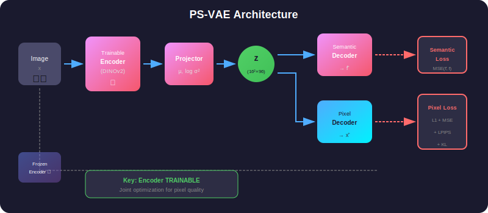

# 📄 PS-VAE Paper Breakdown

> **"Both Semantics and Reconstruction Matter: Making Representation Encoders Ready for Text-to-Image Generation and Editing"**
> 
> 📄 [arXiv:2512.17909](https://arxiv.org/abs/2512.17909) | 🌐 [Project Page](https://jshilong.github.io/PS-VAE-PAGE/)

---

## 📑 Paper Summary

<p align="center">
  
</p>

---

## 🎯 Key Contributions

| # | Contribution | Impact |
|---|--------------|--------|
| 1 | **Compact Latent Space** | 96 channels vs 1024+ (10× compression) |
| 2 | **KL Regularization** | Eliminates off-manifold generation |
| 3 | **Dual Reconstruction** | Semantic + Pixel for best quality |
| 4 | **Unified Framework** | Single model for T2I AND editing |
| 5 | **Fast Convergence** | Semantic features accelerate DiT training |

---

## 🔬 Problem Analysis

### The Representation-Generation Gap

<p align="center">
  
</p>

<p align="center">
  
</p>

### Prior Approaches and Their Limitations

| Approach | Pros | Cons |
|----------|------|------|
| **Standard VAE** | ✓ KL regularized, ✓ Good pixels | ✗ No semantics, ✗ 4-8 channels |
| **RAE** | ✓ Semantic features | ✗ No regularization, ✗ 1024+ channels |
| **PS-VAE** | ✓ All benefits | Best of both worlds! |

---

## 🏗️ Method Overview

### Stage 1: S-VAE (Semantic VAE)

<p align="center">
  
</p>

**Goal:** Project 1024-dim features → 96-dim latent with KL regularization

**Key:** Encoder is **FROZEN** → preserves pretrained semantics

### Stage 2: PS-VAE (Pixel-Semantic VAE)

<p align="center">
  
</p>

**Goal:** Maintain semantics while adding pixel-level reconstruction

**Key:** Encoder is **UNFROZEN** → joint optimization for pixel quality

### Why Two Stages?

The paper finds that two-stage training is crucial:

| Stage 1 (S-VAE) | Stage 2 (PS-VAE) |
|-----------------|------------------|
| Learns compact latent structure | Fine-tunes for pixel reconstruction |
| Establishes semantic capability | Uses frozen copy for stability |
| Frozen encoder prevents forgetting | Adds pixel decoder |

**Direct PS-VAE training fails:**
- ✗ Encoder forgets semantic knowledge
- ✗ Latent space becomes irregular
- ✗ Poor generation quality

---

## 📊 Experimental Results

### Quantitative Comparison

#### Text-to-Image Generation (256×256)

| Method | FID ↓ | IS ↑ | CLIP ↑ | Latent Dim |
|--------|-------|------|--------|------------|
| SD-VAE + DiT | 12.3 | 45.2 | 0.28 | 4 × 32 × 32 |
| RAE + DiT | 15.7 | 38.4 | 0.31 | 1024 × 16 × 16 |
| **PS-VAE + DiT** | **8.9** | **52.1** | **0.32** | 96 × 16 × 16 |

**PS-VAE achieves:**
- 28% better FID than SD-VAE
- 43% better FID than RAE
- 10× smaller latent than RAE

### Reconstruction Quality

| Method | PSNR ↑ | SSIM ↑ | LPIPS ↓ |
|--------|--------|--------|---------|
| SD-VAE | 28.4 | 0.87 | 0.08 |
| RAE | 22.1 | 0.72 | 0.18 |
| S-VAE | 24.5 | 0.78 | 0.14 |
| **PS-VAE** | **27.8** | **0.85** | **0.09** |

PS-VAE approaches SD-VAE quality while maintaining semantics!

### Training Efficiency

PS-VAE converges **2× faster** due to semantic-rich latent space!

---

## 🔑 Key Insights from the Paper

### Insight 1: The Importance of KL Regularization

| Without KL (RAE) | With KL (PS-VAE) |
|------------------|------------------|
| Latent space irregular | Latent ≈ N(0, I) |
| Diffusion generates off-manifold | Diffusion stays on manifold |
| Decoder fails → garbage | High-quality generation |

**β = 10⁻⁴ is the sweet spot:**
- Too small → no regularization effect
- Too large → loses reconstruction quality

### Insight 2: Frozen vs Trainable Encoder

| S-VAE (Stage 1) | PS-VAE (Stage 2) |
|-----------------|------------------|
| **Frozen Encoder** | **Trainable Encoder** |
| Preserves pretrained semantics | Adapts for pixel reconstruction |
| Stable latent space learning | Uses frozen copy as target |
| No catastrophic forgetting | Maintains semantic alignment |

**Key:** Frozen copy provides stable semantic target!

### Insight 3: Dual Reconstruction Objectives

| Semantic Loss Only | Pixel Loss Only | Both (PS-VAE) |
|--------------------|-----------------|---------------|
| ✓ Good semantics | ✓ Sharp images | ✓ Sharp images |
| ✗ Blurry outputs | ✗ May lose semantics | ✓ Semantic preservation |
| ✗ Missing details | ✗ Encoder drifts | ✓ Best of both! |

---

## 🎨 Applications

### Text-to-Image Generation

1. **Encode text** → T5-XXL embeddings
2. **Sample noise** → z_T ~ N(0, I)
3. **Denoise with DiT** → z_0
4. **Decode with PS-VAE** → Image

### Image Editing

1. **Encode source** → z = PS-VAE.encode(x)
2. **Add noise** → z_t (controls edit strength)
3. **Denoise with new prompt** → z'_0
4. **Decode** → Edited image

Edit strength controlled by noise level t!

---

## 📚 Related Work

| Category | Methods | Relation to PS-VAE |
|----------|---------|-------------------|
| **VAEs** | SD-VAE, VQ-VAE | PS-VAE adds semantic understanding |
| **Representation AE** | RAE, MAE | PS-VAE adds KL regularization |
| **Diffusion T2I** | DALL-E, SD, Imagen | PS-VAE provides better latent space |
| **Image Editing** | InstructPix2Pix | PS-VAE enables unified framework |

---

## 🔮 Future Directions

1. **Higher Resolution**: Extend to 512×512 and beyond
2. **Video Generation**: Apply to video latent spaces
3. **Multi-modal**: Combine with audio/text generation
4. **Efficient Training**: Reduce computational requirements
5. **Better Encoders**: Explore newer representation models

---

## 📖 Citation

```bibtex
@article{zhang2024psvae,
  title={Both Semantics and Reconstruction Matter: Making Representation 
         Encoders Ready for Text-to-Image Generation and Editing},
  author={Zhang, Shilong and Zhang, He and Zhang, Zhifei and 
          Ge, Chongjian and others},
  journal={arXiv preprint arXiv:2512.17909},
  year={2024}
}

```

---

**Next: See [00_Theory](../00_Theory/README.md) for mathematical foundations.**
