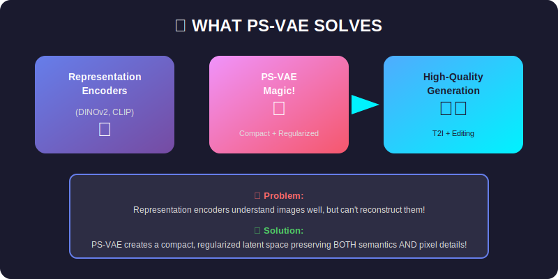

# 📚 PS-VAE Documentation

> Comprehensive documentation for the Pixel-Semantic Variational Autoencoder

---

## 📖 Documentation Index

  

### 📂 Documentation Structure

| Folder/File | Description |
|-------------|-------------|
| 📁 **00_Theory/** | Mathematical foundations from scratch |
| 📁 **01_Paper_Breakdown/** | Detailed paper analysis & insights |
| 📄 **architecture.md** | Complete architecture documentation |
| 📁 **images/** | All SVG architecture diagrams |

---

## 🗺️ Learning Path

| Step | Document | Description | Time |
|------|----------|-------------|------|
| 1️⃣ | [00_Theory/README.md](00_Theory/README.md) | Start here! Learn the math from first principles | 30 min |
| 2️⃣ | [01_Paper_Breakdown/README.md](01_Paper_Breakdown/README.md) | Understand the paper's contributions | 20 min |
| 3️⃣ | [architecture.md](architecture.md) | Deep dive into implementation details | 45 min |

---

## 🎨 Visual Diagrams

All diagrams are available as SVG files in the `images/` folder:

### Core Concepts

| Diagram | File | Description |
|---------|------|-------------|
| Big Picture | `readme_big_picture.svg` | PS-VAE overview |
| Off-Manifold | `readme_off_manifold.svg` | Problem 1 visualization |
| Weak Reconstruction | `readme_weak_reconstruction.svg` | Problem 2 visualization |

### Architecture

| Diagram | File | Description |
|---------|------|-------------|
| S-VAE | `readme_svae_architecture.svg` | Semantic VAE architecture |
| PS-VAE | `readme_psvae_architecture.svg` | Pixel-Semantic VAE architecture |
| DiT | `readme_dit_architecture.svg` | Diffusion Transformer |
| Loss Function | `readme_loss_function.svg` | PS-VAE loss components |

### Training & Inference

| Diagram | File | Description |
|---------|------|-------------|
| Training Pipeline | `readme_training_pipeline.svg` | 3-stage training |
| Latent Comparison | `readme_latent_comparison.svg` | VAE vs RAE vs PS-VAE |
| Key Insights | `readme_key_insights.svg` | Why PS-VAE works |

### Theory

| Diagram | File | Description |
|---------|------|-------------|
| Representation Encoder | `theory_representation_encoder.svg` | DINOv2/CLIP encoders |
| VAE Framework | `theory_vae_framework.svg` | VAE with ELBO |
| Diffusion Process | `theory_diffusion_process.svg` | Forward/reverse diffusion |

---

## 🎯 Quick Reference

### Key Equations

| Component | Equation |
|-----------|----------|
| **Encoding** | $\mathbf{z} = \boldsymbol{\mu} + \boldsymbol{\sigma} \odot \boldsymbol{\epsilon}$ |
| **S-VAE Loss** | $\mathcal{L} = \text{MSE}(\hat{\mathbf{f}}, \mathbf{f}) + \beta \cdot D_{\text{KL}}$ |
| **PS-VAE Loss** | $\mathcal{L} = \alpha \mathcal{L}_{\text{sem}} + \gamma \mathcal{L}_{\text{pix}} + \lambda \mathcal{L}_{\text{perc}} + \beta \mathcal{L}_{\text{KL}}$ |
| **Diffusion** | $\mathbf{z}_t = \sqrt{\bar{\alpha}_t} \mathbf{z}_0 + \sqrt{1-\bar{\alpha}_t} \boldsymbol{\epsilon}$ |
| **DiT Loss** | $\mathcal{L} = \mathbb{E}\left[\|\boldsymbol{\epsilon} - \boldsymbol{\epsilon}_\theta(\mathbf{z}_t, t, \mathbf{c})\|^2\right]$ |
| **CFG** | $\tilde{\boldsymbol{\epsilon}} = \boldsymbol{\epsilon}_\varnothing + s(\boldsymbol{\epsilon}_\mathbf{c} - \boldsymbol{\epsilon}_\varnothing)$ |

### Default Hyperparameters

| Parameter | Value | Description |
|-----------|-------|-------------|
| `latent_dim` | 96 | Latent channel dimension |
| `spatial_size` | 16×16 | Latent spatial resolution |
| `kl_weight` (β) | 10⁻⁴ | KL divergence weight |
| `semantic_weight` (α) | 1.0 | Semantic loss weight |
| `pixel_weight` (γ) | 1.0 | Pixel loss weight |
| `perceptual_weight` (λ) | 0.1 | LPIPS loss weight |
| `cfg_scale` | 7.5 | Classifier-free guidance scale |

---

## 🔗 External Resources

| Resource | Link |
|----------|------|
| 📄 Paper | [arXiv:2512.17909](https://arxiv.org/abs/2512.17909) |
| 🌐 Project Page | [jshilong.github.io/PS-VAE-PAGE](https://jshilong.github.io/PS-VAE-PAGE/) |
| 🤗 DINOv2 | [facebook/dinov2](https://huggingface.co/facebook/dinov2-large) |
| 📊 LPIPS | [richzhang/PerceptualSimilarity](https://github.com/richzhang/PerceptualSimilarity) |

---

## 📝 Contributing to Docs

We welcome documentation improvements! Please:

1. Use the existing SVG diagram style for new visualizations
2. Include mathematical notation where appropriate
3. Add visual examples when possible
4. Keep explanations accessible to newcomers

---

  <b>Happy Learning! 🎓</b>

