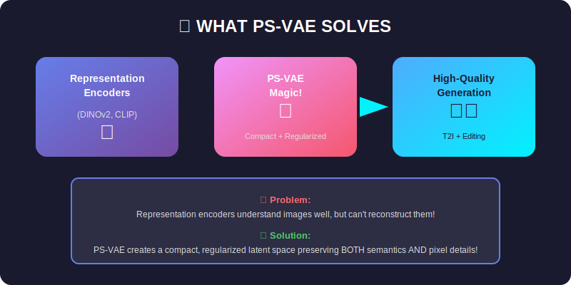
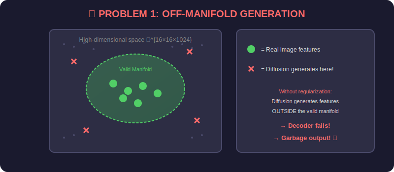
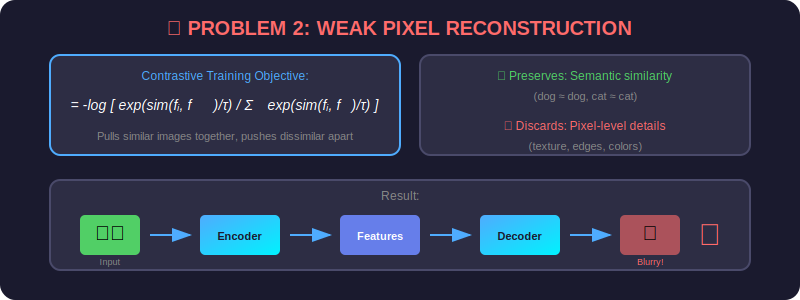
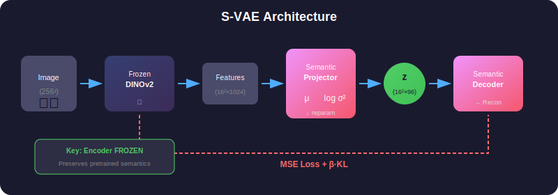
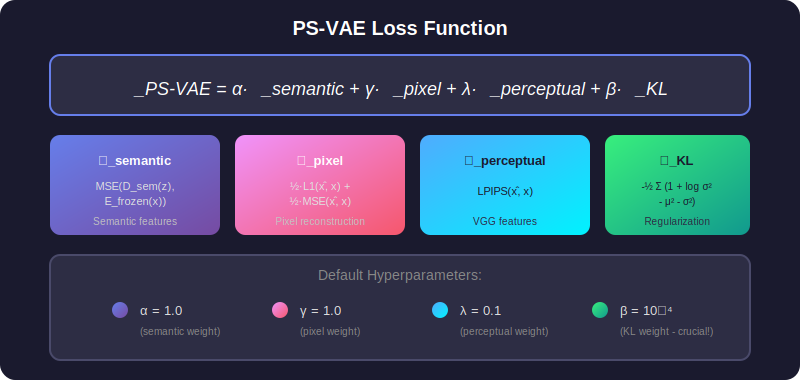
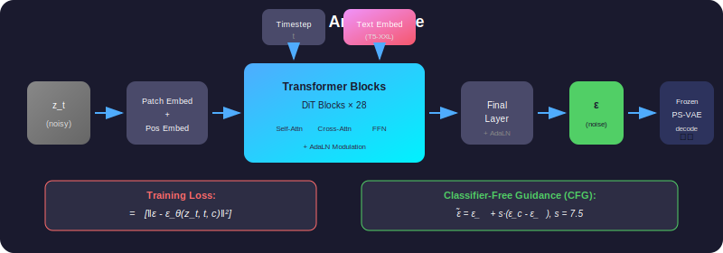
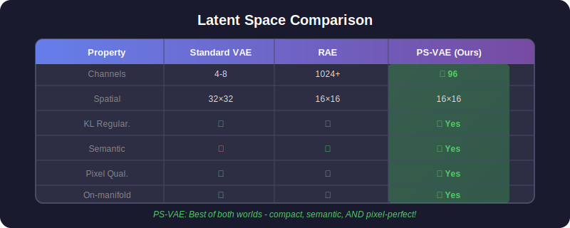

# PS-VAE Architecture Guide

This document provides a comprehensive mathematical and architectural explanation of the PS-VAE (Pixel-Semantic Variational Autoencoder) framework.

## Table of Contents

1. [Overview](#overview)

2. [Problem Formulation](#problem-formulation)

3. [S-VAE: Semantic VAE](#s-vae-semantic-vae)

4. [PS-VAE: Pixel-Semantic VAE](#ps-vae-pixel-semantic-vae)

5. [Diffusion Transformer (DiT)](#diffusion-transformer-dit)

6. [Training Procedures](#training-procedures)

7. [Inference](#inference)

---

## Overview

PS-VAE bridges the gap between representation learning and image generation by creating a compact, semantically-rich latent space suitable for diffusion-based generation.

<p align="center">
  
</p>

### Key Contributions

1. **Compact Latent Space**: 96 channels with 16×16 spatial resolution

2. **KL Regularization**: Prevents off-manifold generation

3. **Dual Reconstruction**: Joint semantic + pixel reconstruction objectives

4. **Unified T2I & Editing**: Single model for generation and editing tasks

---

## Problem Formulation

### The Two Fundamental Problems

<p align="center">
  
</p>

#### Problem 1: Off-Manifold Generation

Given a pretrained representation encoder $E_\phi: \mathbb{R}^{H \times W \times 3} \rightarrow \mathbb{R}^{h \times w \times d}$, the feature space lacks compact regularization.

**Mathematical Issue**: The representation features $\mathbf{f} = E_\phi(\mathbf{x})$ lie in a high-dimensional space $\mathbb{R}^{h \times w \times d}$ (e.g., $d = 1024$), but the intrinsic dimensionality is much lower. Training a diffusion model directly on this space leads to:

$$p_\theta(\mathbf{f}) \neq p_{\text{data}}(\mathbf{f})$$

The generated features $\hat{\mathbf{f}} \sim p_\theta$ often fall outside the valid manifold $\mathcal{M} \subset \mathbb{R}^{h \times w \times d}$, causing decoding failures.

#### Problem 2: Weak Pixel Reconstruction

<p align="center">
  
</p>

Representation encoders are trained with discriminative objectives:

$$\mathcal{L}_{\text{contrastive}} = -\log \frac{\exp(\text{sim}(\mathbf{f}_i, \mathbf{f}_j^+) / \tau)}{\sum_k \exp(\text{sim}(\mathbf{f}_i, \mathbf{f}_k) / \tau)}$$

This objective preserves semantic similarity but discards fine-grained pixel information, leading to:

$$\mathbf{x} \neq D(E(\mathbf{x})) \quad \text{(poor reconstruction)}$$

---

## S-VAE: Semantic VAE

S-VAE addresses the off-manifold problem by projecting representation features into a compact, KL-regularized latent space.

<p align="center">
  
</p>

### Architecture

#### 1. Frozen Representation Encoder

$$\mathbf{f} = E_\phi^{\text{frozen}}(\mathbf{x}) \in \mathbb{R}^{h \times w \times d}$$

where:

- $\mathbf{x} \in \mathbb{R}^{H \times W \times 3}$ is the input image

- $h = w = H/p$ (patch size $p = 14$ for DINOv2)

- $d = 1024$ for DINOv2-Large

#### 2. Semantic Projector (Encoder)

The projector maps high-dimensional features to a compact latent distribution:

$$\boldsymbol{\mu}, \log \boldsymbol{\sigma}^2 = \text{Proj}_\psi(\mathbf{f})$$

**Architecture**:

```
Projector: Linear(d, 512) → LayerNorm → GELU → Linear(512, 256) → LayerNorm → GELU
           +-- Linear(256, z_dim) → μ
           +-- Linear(256, z_dim) → log σ²

```

where $z_{\text{dim}} = 96$ (compact latent dimension).

#### 3. Reparameterization Trick

Sample latent vectors using the reparameterization trick:

$$\mathbf{z} = \boldsymbol{\mu} + \boldsymbol{\sigma} \odot \boldsymbol{\epsilon}, \quad \boldsymbol{\epsilon} \sim \mathcal{N}(\mathbf{0}, \mathbf{I})$$

This enables backpropagation through the sampling operation.

#### 4. Semantic Decoder

Reconstruct the original representation features:

$$\hat{\mathbf{f}} = D_\xi^{\text{sem}}(\mathbf{z})$$

**Architecture**:

```
Decoder: Linear(z_dim, 256) → LayerNorm → GELU → Linear(256, 512) → LayerNorm → GELU
         → Linear(512, d) → ResidualBlock(d) → ResidualBlock(d)

```

### S-VAE Loss Function

$$\mathcal{L}_{\text{S-VAE}} = \mathcal{L}_{\text{semantic}} + \beta \cdot \mathcal{L}_{\text{KL}}$$

#### Semantic Reconstruction Loss

$$\mathcal{L}_{\text{semantic}} = \frac{1}{hwd} \sum_{i,j,k} \left( \hat{f}_{ijk} - f_{ijk} \right)^2 = \text{MSE}(\hat{\mathbf{f}}, \mathbf{f})$$

#### KL Divergence Loss

$$\mathcal{L}_{\text{KL}} = D_{\text{KL}}\left( q_\psi(\mathbf{z}|\mathbf{x}) \| p(\mathbf{z}) \right)$$

For Gaussian distributions with $p(\mathbf{z}) = \mathcal{N}(\mathbf{0}, \mathbf{I})$:

$$\mathcal{L}_{\text{KL}} = -\frac{1}{2} \sum_{i=1}^{z_{\text{dim}}} \left( 1 + \log \sigma_i^2 - \mu_i^2 - \sigma_i^2 \right)$$

**Hyperparameters**:

- $\beta = 10^{-4}$ (small weight for regularization without over-constraining)

---

## PS-VAE: Pixel-Semantic VAE

PS-VAE extends S-VAE by adding pixel-level reconstruction with a trainable encoder.

<p align="center">
  
</p>

### Key Differences from S-VAE

| Aspect | S-VAE | PS-VAE |
|--------|-------|--------|
| Encoder | Frozen | Trainable |
| Reconstruction | Semantic only | Semantic + Pixel |
| Decoder | Semantic only | Semantic + Pixel |

### Architecture

#### 1. Trainable Representation Encoder

$$\mathbf{f} = E_\phi^{\text{train}}(\mathbf{x})$$

The encoder parameters $\phi$ are now updated during training.

#### 2. Frozen Encoder (for Semantic Target)

$$\mathbf{f}^{\text{target}} = E_{\phi_0}^{\text{frozen}}(\mathbf{x})$$

A frozen copy provides stable semantic targets.

#### 3. Pixel Decoder

In addition to the semantic decoder, PS-VAE includes a pixel decoder:

$$\hat{\mathbf{x}} = D_\omega^{\text{pixel}}(\mathbf{z})$$

**Architecture** (Convolutional Upsampling):

```
PixelDecoder:
  Input: z ∈ ℝ^{16×16×96}
  
  Conv2d(96, 512) → GroupNorm → SiLU
  
  for level in [512, 512, 256, 128]:
      ResBlock(in_ch, in_ch)
      ResBlock(in_ch, in_ch)
      Upsample(scale=2)
      Conv2d(in_ch, out_ch)
  
  GroupNorm → SiLU → Conv2d(128, 3)
  
  Output: x̂ ∈ ℝ^{256×256×3}

```

### PS-VAE Loss Function

<p align="center">
  
</p>

$$\mathcal{L}_{\text{PS-VAE}} = \alpha \cdot \mathcal{L}_{\text{semantic}} + \gamma \cdot \mathcal{L}_{\text{pixel}} + \lambda \cdot \mathcal{L}_{\text{perceptual}} + \beta \cdot \mathcal{L}_{\text{KL}}$$

#### Semantic Reconstruction Loss

$$\mathcal{L}_{\text{semantic}} = \text{MSE}\left( D_\xi^{\text{sem}}(\mathbf{z}), E_{\phi_0}^{\text{frozen}}(\mathbf{x}) \right)$$

Note: Target is from the **frozen** encoder, not the trainable one.

#### Pixel Reconstruction Loss

Combined L1 and L2 losses:

$$\mathcal{L}_{\text{pixel}} = \frac{1}{2} \cdot \text{L1}(\hat{\mathbf{x}}, \mathbf{x}) + \frac{1}{2} \cdot \text{MSE}(\hat{\mathbf{x}}, \mathbf{x})$$

where:

$$\text{L1}(\hat{\mathbf{x}}, \mathbf{x}) = \frac{1}{HWC} \sum_{i,j,c} |\hat{x}_{ijc} - x_{ijc}|$$

#### Perceptual Loss (LPIPS)

$$\mathcal{L}_{\text{perceptual}} = \text{LPIPS}(\hat{\mathbf{x}}, \mathbf{x}) = \sum_l \frac{1}{H_l W_l} \sum_{h,w} \left\| \mathbf{w}_l \odot \left( \hat{\phi}_l^{hw} - \phi_l^{hw} \right) \right\|_2^2$$

where $\phi_l$ are VGG features at layer $l$ and $\mathbf{w}_l$ are learned weights.

#### KL Divergence Loss

Same as S-VAE:

$$\mathcal{L}_{\text{KL}} = -\frac{1}{2} \sum_{i=1}^{z_{\text{dim}}} \left( 1 + \log \sigma_i^2 - \mu_i^2 - \sigma_i^2 \right)$$

**Default Hyperparameters**:

- $\alpha = 1.0$ (semantic weight)

- $\gamma = 1.0$ (pixel weight)

- $\lambda = 0.1$ (perceptual weight)

- $\beta = 10^{-4}$ (KL weight)

---

## Diffusion Transformer (DiT)

Once PS-VAE is trained, we train a Diffusion Transformer to generate in the latent space.

<p align="center">
  
</p>

### Diffusion Process

#### Forward Process (Adding Noise)

<p align="center">
  
</p>

Given clean latent $\mathbf{z}_0$, the forward process adds Gaussian noise:

$$q(\mathbf{z}_t | \mathbf{z}_0) = \mathcal{N}\left( \mathbf{z}_t; \sqrt{\bar{\alpha}_t} \mathbf{z}_0, (1 - \bar{\alpha}_t) \mathbf{I} \right)$$

where:

- $\bar{\alpha}_t = \prod_{s=1}^t \alpha_s$

- $\alpha_t = 1 - \beta_t$

- $\beta_t$ follows a scaled linear schedule: $\beta_t \in [10^{-4}, 0.02]$

Equivalently:

$$\mathbf{z}_t = \sqrt{\bar{\alpha}_t} \mathbf{z}_0 + \sqrt{1 - \bar{\alpha}_t} \boldsymbol{\epsilon}, \quad \boldsymbol{\epsilon} \sim \mathcal{N}(\mathbf{0}, \mathbf{I})$$

#### Reverse Process (Denoising)

The reverse process learns to denoise:

$$p_\theta(\mathbf{z}_{t-1} | \mathbf{z}_t) = \mathcal{N}\left( \mathbf{z}_{t-1}; \boldsymbol{\mu}_\theta(\mathbf{z}_t, t), \sigma_t^2 \mathbf{I} \right)$$

### DiT Architecture

#### Input Processing

1. **Patch Embedding**: Each spatial location is treated as a patch

$$\mathbf{h}_0 = \text{Linear}(\mathbf{z}_t) + \mathbf{PE}$$math
where $\mathbf{PE}$ is learnable positional embedding.

2. **Timestep Embedding**: Sinusoidal encoding + MLP

```

\mathbf{t}_{\text{emb}} = \text{MLP}\left( \left[ \sin\left(\frac{t}{10000^{2i/d}}\right), \cos\left(\frac{t}{10000^{2i/d}}\right) \right]_{i=0}^{d/2} \right)

```

3. **Text Embedding**: From T5-XXL encoder

$$\mathbf{c} = \text{TextEncoder}(\text{prompt}) \in \mathbb{R}^{L \times d_{\text{text}}}$$math
#### DiT Block

Each block consists of:

1. **Adaptive Layer Norm (AdaLN)**:

```

\gamma, \beta = \text{MLP}(\mathbf{t}_{\text{emb}})
\text{AdaLN}(\mathbf{h}) = \gamma \odot \text{LayerNorm}(\mathbf{h}) + \beta

```

2. **Self-Attention**:

$$\mathbf{Q}, \mathbf{K}, \mathbf{V} = \mathbf{h} \mathbf{W}_Q, \mathbf{h} \mathbf{W}_K, \mathbf{h} \mathbf{W}_V
\text{Attention}(\mathbf{Q}, \mathbf{K}, \mathbf{V}) = \text{softmax}\left( \frac{\mathbf{Q}\mathbf{K}^\top}{\sqrt{d_k}} \right) \mathbf{V}$$math

3. **Cross-Attention** (with text):

```

\mathbf{Q} = \mathbf{h} \mathbf{W}_Q, \quad \mathbf{K}, \mathbf{V} = \mathbf{c} \mathbf{W}_K, \mathbf{c} \mathbf{W}_V

```

4. **Feed-Forward Network**:

$$\text{FFN}(\mathbf{h}) = \text{GELU}(\mathbf{h} \mathbf{W}_1) \mathbf{W}_2$$math

5. **Gated Residual**:

```

\mathbf{h} = \mathbf{h} + \text{gate} \odot \text{Block}(\mathbf{h})

```

### Training Objective

$$\mathcal{L}_{\text{DiT}} = \mathbb{E}_{\mathbf{z}_0, \boldsymbol{\epsilon}, t} \left[ \left\| \boldsymbol{\epsilon} - \boldsymbol{\epsilon}_\theta(\mathbf{z}_t, t, \mathbf{c}) \right\|_2^2 \right]$$

where:

- $\mathbf{z}_0 = \text{PS-VAE.encode}(\mathbf{x})$

- $\boldsymbol{\epsilon} \sim \mathcal{N}(\mathbf{0}, \mathbf{I})$

- $t \sim \text{Uniform}(1, T)$

- $\mathbf{c}$ is the text conditioning

### Classifier-Free Guidance (CFG)

During inference, we use CFG for better text alignment:

$$\tilde{\boldsymbol{\epsilon}}_\theta = \boldsymbol{\epsilon}_\theta(\mathbf{z}_t, t, \varnothing) + s \cdot \left( \boldsymbol{\epsilon}_\theta(\mathbf{z}_t, t, \mathbf{c}) - \boldsymbol{\epsilon}_\theta(\mathbf{z}_t, t, \varnothing) \right)$$

where:

- $s$ is the guidance scale (typically 7.5)

- $\varnothing$ is the null/empty text embedding

---

## Training Procedures

<p align="center">
  
</p>

### Stage 1: Train S-VAE

**Objective**: Learn compact, regularized latent space

```python
# Freeze encoder
encoder.requires_grad_(False)

# Training loop
for x in dataloader:
    f = encoder(x)           # Frozen features
    mu, log_var = projector(f)
    z = reparameterize(mu, log_var)
    f_recon = semantic_decoder(z)
    
    loss_semantic = MSE(f_recon, f)
    loss_kl = -0.5 * (1 + log_var - mu² - exp(log_var)).mean()
    loss = loss_semantic + β * loss_kl
    
    loss.backward()

```

### Stage 2: Train PS-VAE

**Objective**: Add pixel reconstruction with trainable encoder

```python
# Unfreeze encoder
encoder.requires_grad_(True)

# Keep frozen copy for semantic target
frozen_encoder = copy.deepcopy(encoder)
frozen_encoder.requires_grad_(False)

# Training loop
for x in dataloader:
    f = encoder(x)                    # Trainable
    f_target = frozen_encoder(x)      # Frozen target
    
    mu, log_var = projector(f)
    z = reparameterize(mu, log_var)
    
    f_recon = semantic_decoder(z)
    x_recon = pixel_decoder(z)
    
    loss_semantic = MSE(f_recon, f_target)
    loss_pixel = 0.5 * L1(x_recon, x) + 0.5 * MSE(x_recon, x)
    loss_perceptual = LPIPS(x_recon, x)
    loss_kl = -0.5 * (1 + log_var - mu² - exp(log_var)).mean()
    
    loss = α*loss_semantic + γ*loss_pixel + λ*loss_perceptual + β*loss_kl
    
    loss.backward()

```

### Stage 3: Train DiT

**Objective**: Learn to generate in PS-VAE latent space

```python
# Freeze PS-VAE
psvae.requires_grad_(False)

# Training loop
for x, text in dataloader:
    z_0 = psvae.encode(x)              # Clean latent
    t = randint(1, T)                   # Random timestep
    ε = randn_like(z_0)                 # Noise
    
    z_t = sqrt(α̅_t) * z_0 + sqrt(1 - α̅_t) * ε   # Add noise
    
    text_emb = text_encoder(text)
    ε_pred = dit(z_t, t, text_emb)
    
    loss = MSE(ε_pred, ε)
    loss.backward()

```

---

## Inference

### Text-to-Image Generation

```python
# 1. Encode text
text_emb = text_encoder(prompt)

# 2. Initialize from noise
z_T = randn(1, 16, 16, 96)

# 3. DDIM sampling
for t in reversed(range(T)):
    # Predict noise with CFG
    ε_uncond = dit(z_t, t, null_emb)
    ε_cond = dit(z_t, t, text_emb)
    ε_pred = ε_uncond + cfg_scale * (ε_cond - ε_uncond)
    
    # DDIM step
    z_0_pred = (z_t - sqrt(1 - α̅_t) * ε_pred) / sqrt(α̅_t)
    z_{t-1} = sqrt(α̅_{t-1}) * z_0_pred + sqrt(1 - α̅_{t-1}) * ε_pred

# 4. Decode to image
image = psvae.decode(z_0)

```

### DDIM Sampling Formula

$$\mathbf{z}_{t-1} = \sqrt{\bar{\alpha}_{t-1}} \underbrace{\left( \frac{\mathbf{z}_t - \sqrt{1-\bar{\alpha}_t} \boldsymbol{\epsilon}_\theta}{\sqrt{\bar{\alpha}_t}} \right)}_{\text{predicted } \mathbf{z}_0} + \sqrt{1 - \bar{\alpha}_{t-1} - \sigma_t^2} \cdot \boldsymbol{\epsilon}_\theta + \sigma_t \boldsymbol{\epsilon}$$

For deterministic sampling (DDIM), set $\sigma_t = 0$.

---

## Latent Space Comparison

<p align="center">
  
</p>

| Property | Standard VAE | RAE | PS-VAE (Ours) |
|----------|-------------|-----|---------------|
| Channels | 4-8 | 1024+ | **96** |
| Spatial | 32×32 | 16×16 | 16×16 |
| Regularization | KL | None | **KL** |
| Semantic | ✗ | ✓ | **✓** |
| Pixel Quality | ✓ | ✗ | **✓** |
| On-manifold | ✓ | ✗ | **✓** |

---

## Summary

The PS-VAE framework provides:

1. **Compact Representation**: 96 channels vs 1024+ in RAE

2. **KL Regularization**: Ensures on-manifold generation

3. **Dual Reconstruction**: Semantic + Pixel for best of both worlds

4. **Fast Convergence**: Semantic features accelerate diffusion training

5. **High Quality**: State-of-the-art reconstruction and generation

### Key Equations

| Component | Equation |
|-----------|----------|
| Encoding | $\mathbf{z} = \boldsymbol{\mu} + \boldsymbol{\sigma} \odot \boldsymbol{\epsilon}$ |
| S-VAE Loss | $\mathcal{L} = \text{MSE}(\hat{\mathbf{f}}, \mathbf{f}) + \beta \cdot D_{\text{KL}}$ |
| PS-VAE Loss | $\mathcal{L} = \alpha \mathcal{L}_{\text{sem}} + \gamma \mathcal{L}_{\text{pix}} + \lambda \mathcal{L}_{\text{perc}} + \beta \mathcal{L}_{\text{KL}}$ |
| Diffusion | $\mathbf{z}_t = \sqrt{\bar{\alpha}_t} \mathbf{z}_0 + \sqrt{1-\bar{\alpha}_t} \boldsymbol{\epsilon}$ |
| DiT Loss | $\mathcal{L} = \mathbb{E}\left[\|\boldsymbol{\epsilon} - \boldsymbol{\epsilon}_\theta(\mathbf{z}_t, t, \mathbf{c})\|^2\right]$ |
| CFG | $\tilde{\boldsymbol{\epsilon}} = \boldsymbol{\epsilon}_\varnothing + s(\boldsymbol{\epsilon}_\mathbf{c} - \boldsymbol{\epsilon}_\varnothing)$ |
